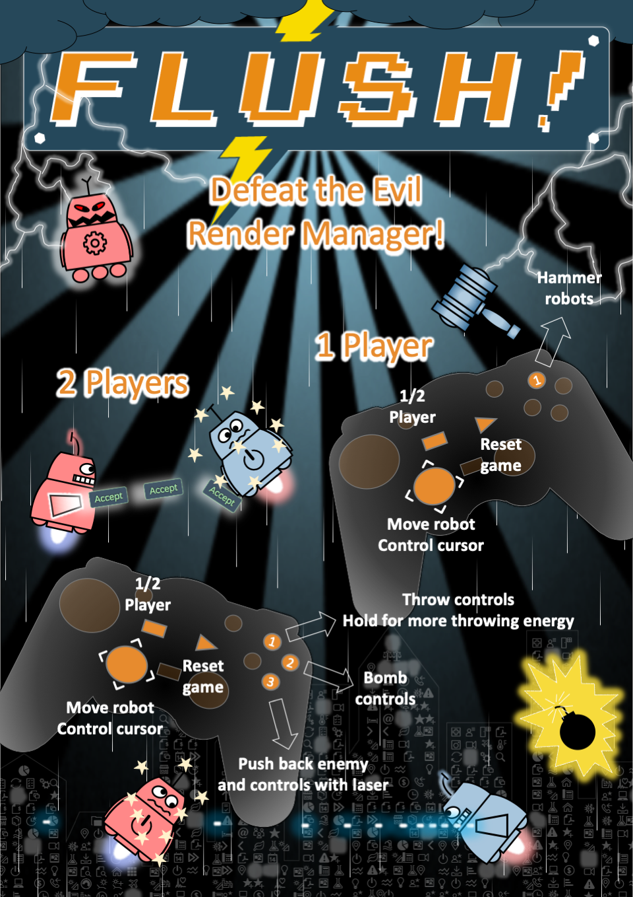
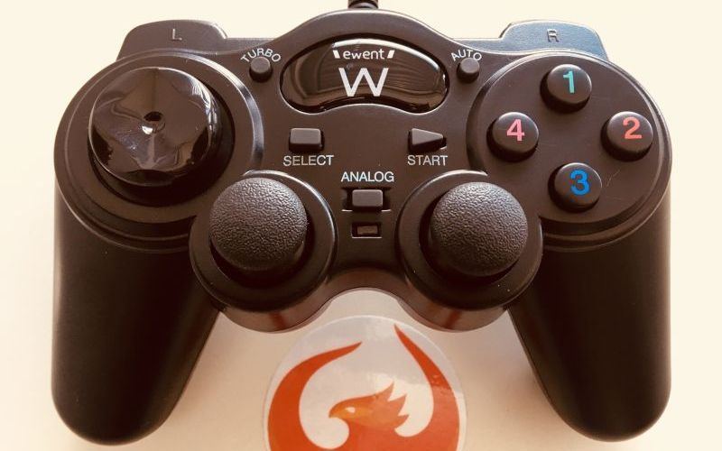
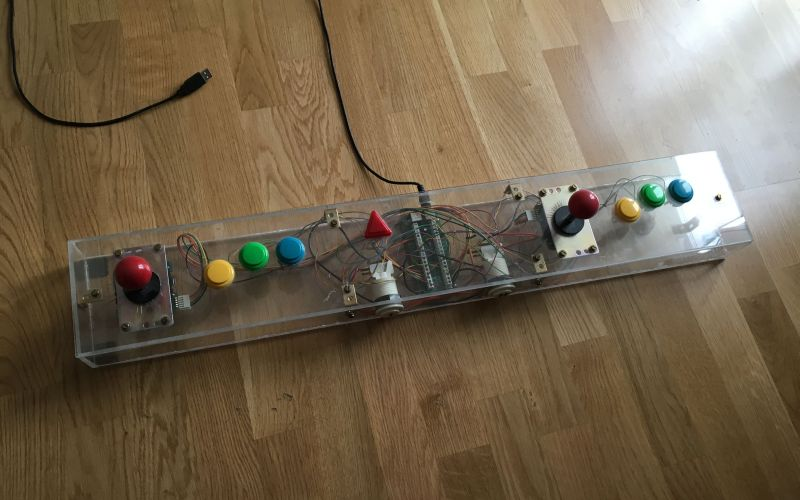

# Input Control

This page contains detailed instructions about the game input control and key mappings.
If you like to use game pads or other types of game controllers, please check the corresponding sections below.

## Game Manual



## Mouse Input

All single player levels can be played with mouse, touch, and keyboard input.
Using mouse or touch input, you can aim with the hammer or magnet to score points.

The multiplayer levels are keyboard-only and come with additional game actions.

## Keyboard Input

The keyboard setup is a basic game configuration for two players using one shared keyboard.
Player 1 uses WASD and Player 2 uses the ARROW keys to move. Action buttons are configured close to the movement keys for maximum convenience.

The following mapping table shows all used keys in the game.
When Game Pads or arcade controllers are used, the input can be mapped to the corresponding keyboard events.

|Gamepad|Keyboard|Game Event|
|-----|---------------|-----|
|Player 1 left|W|Move left|
|Player 1 right|A|Move right|
|Player 1 up|S|Move up/fly|
|Player 1 down|D|Move down|
|Player 1 button 1|SPACE|Shoot/Hit|
|Player 1 button 2|B|Bomb|
|Player 1 button 3|CTRL|Laser|
|Player 2 left|ARROW LEFT|Move left|
|Player 2 right|ARROW RIGHT|Move right|
|Player 2 up|ARROW UP|Move up/fly|
|Player 2 down|ARROW DOWN|Move down|
|Player 2 button 1|ENTER|Shoot/Hit|
|Player 2 button 2|NUMPAD ,|Bomb|
|Player 2 button 3|NUMPAD 0|Laser|
|Player 1/2 start|ESC|Reset|
|Player 1/2 select|3|Switch Game Mode|

## Game Pad Controllers (2 Player Game Lounge Setup)



1. Download the JoyToKey control program to map keycodes: http://joytokey.net/download/JoyToKey_en.zip

2. Plug in the game pads and check that the controls highlight in JoyToKey as you interact with the game pad

3. Create an new configuration named ```JoyToKeyFlush``` with "right-click > New"

4. Close the program with the windows task manager by selecting "End Task"

5. Copy the configuration file [JoyToKeyFlush.cfg](software/JoyToKeyFlush.cfg) over the newly created configuration in the program folder

6. OPTIONAL: Remap the keys as needed by clicking on the control to be changed and pressing a new button on the keyboard

> Note: JoyToKey is a shareware and license key (price = $7.00 USD) needs to be purchased for continued use.


## Using an IPAC Arcade Controller (Custom Mame Controller Setup)



1. Download the IPAC control program to map keycodes: http://www.ultimarc.com/WinIPAC_Setup.zip

2. Remap the keys as needed by clicking on the control to be changed and pressing a new button on the keyboard

3. Program the IPAC (app needs to be started as Administrator to install the driver)

4. See mapping table in section above for the default programming

> Note: The programming actually happens on the IPAC controller, not in the software, handle with care and do not disconnect while configuring
