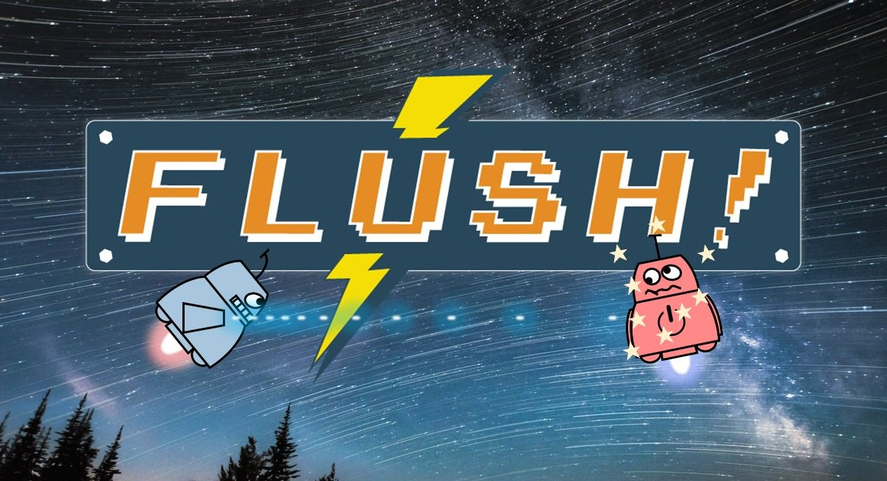

# Flush! Defeat the Evil Render Manager

An innovative and fun game combining [OpenUI5](https://github.com/SAP/openui5) and [CreateJS](https://createjs.com/) to showcase real-time and interaction capabilities of UI5 technology. Browse the source code to look behind the scenes or play the game to see Flush! in action.

**[Play Flush Online!](http://sap.github.io/ui5-flush-game)**

## How to Play

Flush! can be played in single player or two player mode. Use your mouse, fingers, or keyboard to score points.
Multiplayer levels are keyboard-only. The game can also be played with game pads or custom game controllers.

Follow the in-game instructions or check the [input control](InputControl.md) page for more details.

## Background Information

Flush! is an innovation project that brings together Web app capabilities of OpenUI5 with open source game and effect frameworks:

* [OpenUI5](https://github.com/SAP/openui5) (app and game mechanics)
* [CreateJS](https://createjs.com/) (canvas rendering, sound, animations)
* [Box2D](https://box2d.org/) (physics)
* [dom-to-image](https://github.com/tsayen/dom-to-image) (UI5 control to canvas mapping)

We leverage the enterprise-grade UI5 technology with custom controls, custom theming, sprite effects, game mechanics, and scripted levels to create a unique browser game.

## Support

To report a bug, please open an issue.

## Contributing

We welcome your contributions. For small fixes and improvements simply create a Pull Request in this repository. For larger changes, please first get in touch with us in the [#flush](https://openui5.slack.com/messages/CHV1YCNG6) channel of the [OpenUI5 Community Slack](https://ui5-slack-invite.cfapps.eu10.hana.ondemand.com/). 

Due to legal reasons, contributors will be asked to accept a DCO before they submit the first pull request to this projects, this happens in an automated fashion during the submission process. SAP uses [the standard DCO text of the Linux Foundation](https://developercertificate.org/).

## Download and Installation

> *Requirements:* The [git client](https://git-scm.com/) and [Node.js](https://nodejs.org/) must be installed.

To run a local instance of the game, follow these simple setup steps:

1. Clone this repository

2. Install npm dependencies with `npm install`

3. Run the game with `npm start`

## Thirdparty

The following media assets and thirdparty libraries were used in this project:

* [Credits and Attribution for sounds used in the game](SoundCredits.md)
* [List of thirdparty libraries and recommended sofware](Thirdparty.md)

## License

Copyright (c) 2022 SAP SE or an SAP affiliate company. All rights reserved.
This file is licensed under the Apache Software License, v.2 except as noted otherwise in the [LICENSE](/LICENSE) file.

Have fun playing the game!

**The Flush! Team**
